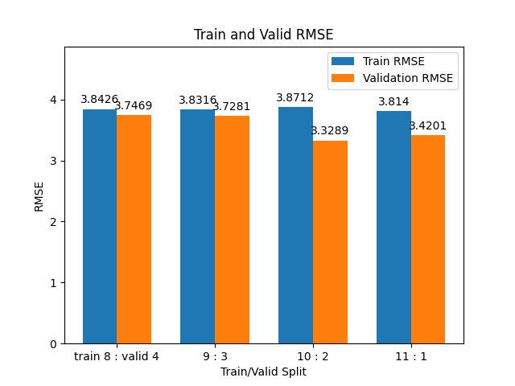
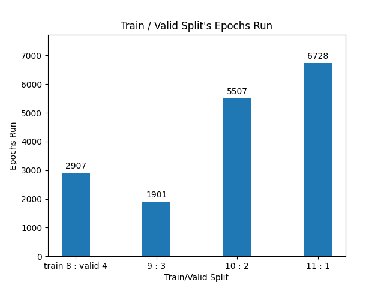

# 作業報告: 使用 Linear Regression 預測 PM2.5

## 1. Feature Selection & Pre-processing
> How do you select features for your model input, and what preprocessing did you perform?

### 1.1 Feature Selection

為了預測第10小時的 PM2.5，我將 data 中全部 18 個屬性作為 Linear Regression Model 的 Feature，包括: 
- `AMB_TEMP, CH4, CO, NMHC, NO, NO2, NOx, O3, PM10, PM2.5, RAINFALL, RH, SO2, THC, WD_HR, WIND_DIREC, WIND_SPEED, WS_HR`。

* 我實作的 model 也支援特定 feature ，例如只使用 `CH4` 和 `CO` 來分析其對模型準確度的影響。但再經過 ablation study 過後，我發現去掉個別 feature 對模型影響不大，最後還是使用所有 feature 進行訓練，且為表現最好的 model

    


### 1.2 Data Cleaning

* 由於無論 train 或是 test 的 value 欄位資料，皆有包含非數值資料（如 `"x"`, `"#"` 等）
* 因此我先將這些不合法資料，轉換為 `NaN`，確保模型僅使用有效數值。
* 其中 SO2 的資料缺少嚴重，甚至有整 row 資料缺失的情況
* 其次是 NOx、和其他 Feature 也有部分缺少資料的情況

### 1.3 Data Imputation

對於資料清理後的 `NaN` 資料，我採用以下補充方法:

1. 若整個 row 都是 `NaN`，則整行填入 `0`。
2. 若整個 row 只有一個數值，其餘為 `NaN`，則用該數值填滿整行。
3. 若整個 row 有多個有效數值，則用該行的平均值填補 `NaN`。

此處理能將原本填入 `NaN` 的資料，改成填入可能有意義的近似值，這對於沒有完整資料的 Model 訓練有幫助。

Note: 我試過使用 Linear Interpolation (線性內插) 的方式進行 `NaN` 資料補全， 但效果表現不好，最好只能達到 RMSE = 4.18。 

### Structured Data 

對 train 和 test 資料的分析
- train.csv
   - 訓練資料 (`train.csv`) 中一共有 12 個月 × 20 天 × 24 小時 × 18 特徵 = 4320 行。
  - 同時，由於每個月 20 天，是連續資料，如: 1/2 23hr 和 1/3 0hr 是連續的兩個小時，其中必然有著時間上的相依性。
  - => 因此，我將 train.csv 資料組合成 12 組 20 days * 24 hr 的連續資料，
  - => 這連續的 480 小時中的資料，都能透過 sliding window 進行取任意連續 9 小時資料，預測第 10 小時資料

- test.csv
  - 測試資料 (`test.csv`) 中的每個 index 為獨立的 9 小時序列，不跨天。
  - 因此 test.csv 的資料須彼此視為獨立樣本。

---

## 2. 訓練資料量的比較
> Compare the impact of different amounts of training data on the PM2.5 prediction accuracy. Visualize the results and explain them.

### 2-1 方法
* 以月份為單位拆分資料作為驗證集，保持時間連續性。
* 嘗試不同訓練資料量：前 8 個月、9 個月、10 個月、11個月。
* 剩餘作為 valid set 
* 使用 **RMSE** 作為驗證指標。

### 2-2 結果

- train set / valid set 的 月份比較，ex: 8:4 = train set 取前 8 個月資料，valid set 取後 4 個月資料
- 不同 train set 和 valid set 的 RMSE 比較
  - epochs = 10000, default setting

| train / valid | Train RMSE | Validation RMSE | Epochs |
| ------------- | ---------- | --------------- | ------ |
| 8 : 4         | 4.0805     | 3.7969          | 10000  |
| 9 : 3         | 4.0583     | 3.7901          | 10000  |
| 10 : 2        | 4.0854     | 3.4406          | 10000  |
| 11 : 1        | 4.0202     | 3.5780          | 10000  |

  - epochs = 10000, patience = 1000, standardize

| train / valid | Train RMSE | Validation RMSE | Epochs (Early-Exit) |
| ------------- | ---------- | --------------- | ------------------- |
| 8 : 4         | 3.8426     | 3.7469          | 2907                |
| 9 : 3         | 3.8316     | 3.7281          | 1901                |
| 10 : 2        | 3.8712     | 3.3289          | 5507                |
| 11 : 1        | 3.8140     | 3.4201          | 6728                |

- RMSE for different amount of data
  
- Epochs for different amount of data
  


### 2-3 分析
* 增加訓練資料可以提升訓練與驗證 RMSE。
* 資料量小（3個月）容易 overfitting，訓練 RMSE 低但驗證 RMSE 高。
* 使用全部12個月資料可獲得最穩定且準確的預測。
  * 但需要先用 train 和 valid set 分離的方式，確保模型在 Valid set 上也有不錯的表現，可泛化、避免 overfit

Note: 
- 這邊可以觀察到在兩次實驗時， train/valid 比例為 10:2 時，Train RMSE 較高，且 Valid RMSE 偏低。
- 猜測可能是因為第 10 個月的資料，是比較難預測的，導致給予 model 更多資料的情況下，
- Train set 的 RMSE 反而降低，而 Valid set 的 RMSE 因缺少 10 月資料而升高


---

## 3. Regulation
> Discuss the impact of regularization on PM2.5 prediction accuracy.

### 3-1 正規化方法

* 在 gradient descent 中加入 **L2 regularization** (Ridge Regression):

    $
    w \gets w - \eta (\frac{\partial \text{RMSE}}{\partial w} + \lambda w)
    $

* 其中 `λ` 為正規化係數。
* 無正規化時，模型容易 overfit，訓練 RMSE 很低但驗證 RMSE 較高。
* 加入 L2 regularization 可減少 overfitting，訓練 RMSE 輕微上升，驗證 RMSE 下降。
* 過大 λ 會造成 underfit，訓練與驗證 RMSE 都上升。

### 3-2 正規化結論

* L2 regularization 對控制 overfitting 效果顯著。
* 配合獨立月份的 validation set ，可以確保模型對沒見過的資料具備泛化的能力。

---

## 4. 實作摘要

任務目標: 
* **介紹**: 這是一個使用 `numpy` 實作的 Linear Regression + gradient descent。
* **輸出**: 預測所有 `test.csv` 第10小時 PM2.5。

程式介紹: 
* **特徵**: 
  * 屬性: 18 種 Feature (SO2, NOx, AMP_TEMP ...)，
  * 時間: 一共12組(月) 連續20天的24hr資料，因此採用sliding window 9小時，捕捉連續9小時資訊。
* **資料清理**: 非數值 → NaN； NaN → 補充。
* **驗證集**: 月份為單位切分資料。
* **正規化**: L2 (Ridge) + Early Stopping 根據驗證 RMSE。
* **附加功能**: 
  * 加上 store model / load model 讓 model 可以進行 continue training 和 Prediction 復現功能
  * 使用所有特徵與12個月訓練資料效果最佳。
  * 實作 Early stopping 可避免過度訓練，減少 overfitting。

### 程式執行方式: (可直接見 README.md)
- 表現最好的參數
```sh
python train_model.py --train ./train.csv --test ./test.csv \
    --out_model trained_model.npz --out_pred predictions.csv \
    --epochs 20000 --val_months 0 --patience 1000 --standardize
```